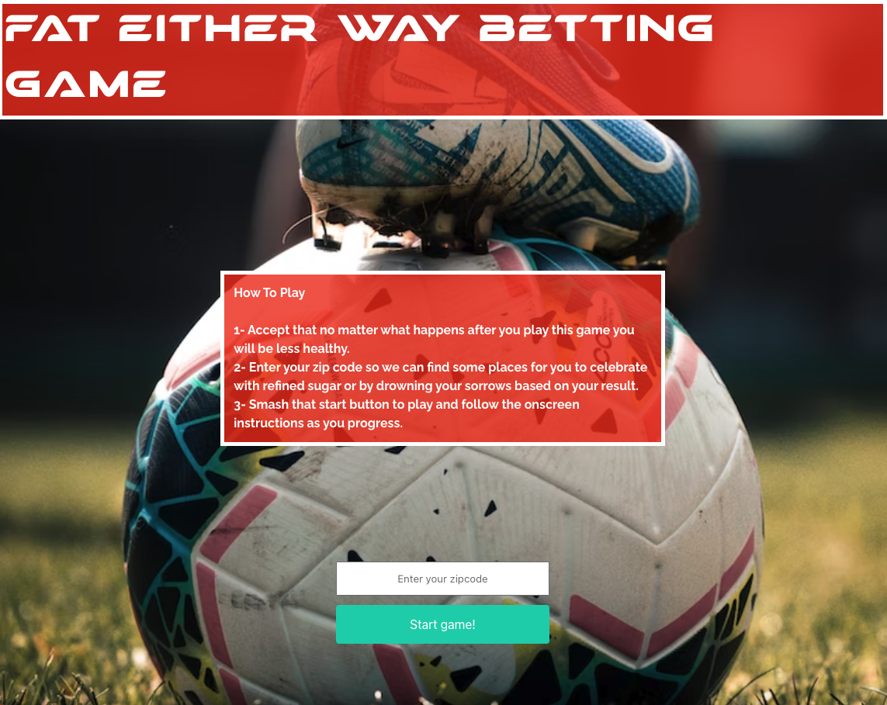

# Fat Either Way Betting Game

## Description

- Deployed Website Link - [https://nganpham89.github.io/Soccer-Betting-Mini-Game/]

This website serves to provide an excuse to consume unhealthy food, add some humor to soccer games, and inform the user where they could go to eat to their hearts content once the game is over. When using this website you will input your zip code and we will find both donut shops and bars near you. After that you will be given the option to choose a soccer league and then the next match in that league will be displayed. Simply click on who you think will win that match and we will compare your prediction to our "expert" opinion and if they're the same, YOU WIN! Upon winning you will be given that list of donut shops and and a recommendation to eat some donuts to celebrate your recent tiny victory. If you choose the team we think will lose the match, then you lose. Upon losing you will be given a list of bars in your area so you can drown your sorrows. 

This website was built for comedic effect but does display accurate information with regards to who is playing and when as well as the addresses of donut shops and bars near the user inputted zip code. 

- We were motivated to create this website out of our appreciation for soccer and comedy. After spending some time going discussing what we could build to satisfy our interests, we settles on a simple sports betting game where you bet a bit of your waist line instead of money. 
- This website solves the problem of not having a good excuse to go out and eat junk food.
- When developing this website we learned a fair few things including 
    - APIs are often rather expensive and complicated. The ones that aren't expensive often come with poor documentation. Eventually we found some APIs that were both functional and easy to work with.
    - Bulma is an interesting CSS framework. It does its job of making CSS easier to build out but it comes at the cost of being difficult to overwrite and provide custom styling. I'd use it again for small projects.
    - A big part of being a developer is having soft skills
    - Tools like Kanban are excellent for managing tasks and keeping up with progress
    - "git pull origin main" is the most important git command most of the time.

## Installation

Just visit this link and follow the onscreen instructions [https://nganpham89.github.io/Soccer-Betting-Mini-Game/]

## Usage

When using this website you will input your zip code and we will find both donut shops and bars near you. After that you will be given the option to choose a soccer league and from there the next match in that league will be displayed. Simply click on who you think will win that match and we will compare your prediction to our "expert" opinion and if they're the same, YOU WIN! Upon winning you will be given that list of donut shops and and a recommendation to eat some donuts to celebrate your recent tiny victory. If you choose the team we think will lose the match, then you lose. Upon losing you will be given a list of bars in your area to drown your sorrows. 

Upon following visiting the website you will find this as the first page

## Credits

url to GitHub repository URL to GitHub repository:
https://github.com/NganPham89/Soccer-Betting-Mini-Game

Developers

- Ngan Pham: https://github.com/NganPham89
- Gill: https://github.com/EverittGill
- Georgina Xavier: https://github.com/Georgina5-2
- Kevin Rodriguez Silveira: https://github.com/krsilveira
- Kaitlyn Atif: https://github.com/kaitlynatif

APIs
- https://www.api-football.com/
- https://www.microsoft.com/en-us/bing/apis/bing-web-search-api

Browsers - Chrome, Mozilla Firefox
Operating Systems - Windows and Mac
Version Control Systems - Git and Github
Coding Platform - Microsoft Visual Studio Code
Programming languages and libraries - HTML, CSS, JavaScript, jQuery, DayJS, and Bulma

## License

MIT license 

## Features

- Ability to find donut shops and bars near a user inputted zip code
- Displays the soonest upcoming game in a chosen soccer league and provides the match date. It provides the predicted winner as well after the user makes a prediction about who will win. 
- Humorous design

